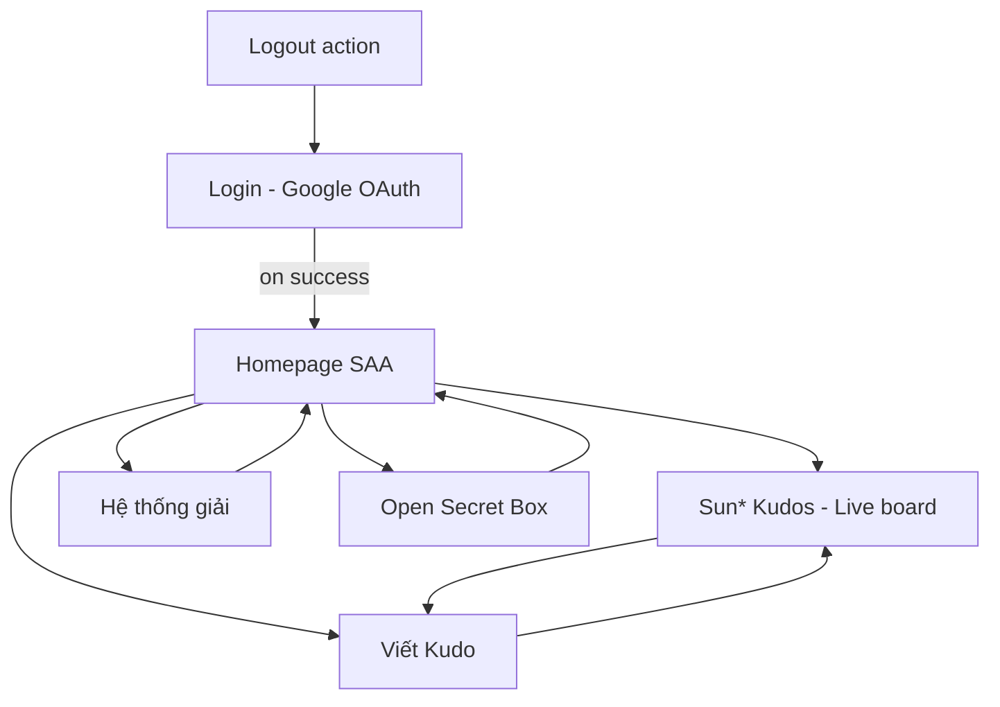
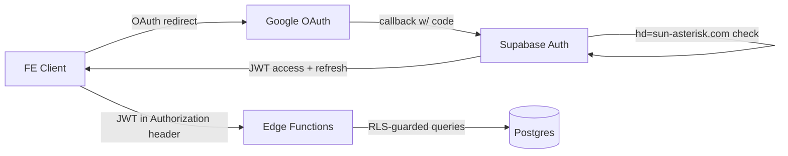

# Screen Flow Overview

## Project Info
- **Project Name**: SAA 2025 — Sun* Kudos (Server-side)
- **Figma File Key**: 9ypp4enmFmdK3YAFJLIu6C
- **Figma URL**: https://www.figma.com/design/9ypp4enmFmdK3YAFJLIu6C
- **MoMorph URL**: https://momorph.ai/files/9ypp4enmFmdK3YAFJLIu6C
- **Created**: 2026-05-11
- **Last Updated**: 2026-05-11
- **Scope note**: This file tracks the **6 server-side-relevant screens** of the SAA 2025 project. UI-only frames (dropdown components, icons, typography) are excluded — they don't drive backend endpoints. Updates incrementally as each screen is specified.

---

## Discovery Progress

| Metric | Count |
|--------|-------|
| In-scope screens (BE) | 6 |
| Discovered (spec.md exists) | 6 |
| Remaining | 0 |
| Completion | 100% |

---

## Screens

| # | Screen Name | Frame ID | Figma Link | Status | Detail File | Predicted APIs | Navigates To |
|---|-------------|----------|------------|--------|-------------|----------------|--------------|
| 1 | Login | `GzbNeVGJHz` | [open](https://momorph.ai/files/9ypp4enmFmdK3YAFJLIu6C/screens/GzbNeVGJHz) | planned | spec / plan / tasks | OAuth callback, session, logout, user profile, language pref | Homepage SAA |
| 2 | Homepage SAA | `i87tDx10uM` | [open](https://momorph.ai/files/9ypp4enmFmdK3YAFJLIu6C/screens/i87tDx10uM) | planned | spec / plan / tasks | event config, awards catalog, notifications (list + unread-count + mark-read) | Live board, Viết Kudo, Hệ thống giải, Open secret box |
| 3 | Sun* Kudos — Live board | `MaZUn5xHXZ` | [open](https://momorph.ai/files/9ypp4enmFmdK3YAFJLIu6C/screens/MaZUn5xHXZ) | planned | spec / plan / tasks | feed, highlights (mv), spotlight, stats, hashtags, departments, like RPC, user lookup | Viết Kudo, Secret Box, Profile |
| 4 | Viết Kudo | `ihQ26W78P2` | [open](https://momorph.ai/files/9ypp4enmFmdK3YAFJLIu6C/screens/ihQ26W78P2) | planned | spec / plan / tasks | POST /kudos (RPC), upload-url, /users typeahead, /hashtags?q, notifications produced | Live board |
| 5 | Hệ thống giải | `zFYDgyj_pD` | [open](https://momorph.ai/files/9ypp4enmFmdK3YAFJLIu6C/screens/zFYDgyj_pD) | planned | spec / plan / tasks | extends award (long_desc, quantity, unit, value_vnd); GET /awards/{slug}; GET /awards?detail=true | Homepage SAA |
| 6 | Open secret box — chưa mở | `J3-4YFIpMM` | [open](https://momorph.ai/files/9ypp4enmFmdK3YAFJLIu6C/screens/J3-4YFIpMM) | planned | spec / plan / tasks | badge catalog (drop weights), secret_box entity, RPC fn_open_secret_box (FOR UPDATE SKIP LOCKED) | Homepage SAA |

---

## Navigation Graph (provisional)

---

## API Endpoints Summary (running list, updated per spec)

| Endpoint | Method | Screens Using | Purpose | Status |
|----------|--------|---------------|---------|--------|
| `/auth/v1/authorize?provider=google` | GET | Login | Initiate Google OAuth flow | Supabase built-in |
| `/auth/v1/callback` | GET | Login | OAuth callback handler | Supabase built-in |
| `/auth/v1/logout` | POST | (any) | Invalidate session | Supabase built-in |
| `/auth/v1/token?grant_type=refresh_token` | POST | (any) | Refresh access token | Supabase built-in |
| `/functions/v1/me` | GET | Login, Home | Return current user profile (post-OAuth) | New |
| `/functions/v1/me/language` | PATCH | Login (header), any | Persist UI language preference | New |
| `/functions/v1/config/event` | GET | Homepage SAA | Event datetime + meta for countdown | New |
| `/functions/v1/awards` | GET | Homepage SAA | Awards catalog (6 rows) | New |
| `/functions/v1/me/notifications/unread-count` | GET | Homepage SAA | Badge count | New |
| `/functions/v1/me/notifications` | GET | Homepage SAA | Notification panel list | New |
| `/functions/v1/me/notifications/{id}` | PATCH | Homepage SAA | Mark one read | New |
| `/functions/v1/me/notifications/mark-all-read` | POST | Homepage SAA | Mark all read | New |
| `/functions/v1/kudos` | GET | Live board | Paginated kudos feed with filters | New |
| `/functions/v1/kudos/highlights` | GET | Live board | Top 5 carousel (MV-backed) | New |
| `/functions/v1/kudos/spotlight` | GET | Live board | Recipient aggregation + search | New |
| `/functions/v1/kudos/stats` | GET | Live board | Totals + top senders/receivers | New |
| `/functions/v1/kudos/{id}/like` | POST | Live board | Like (idempotent, sender forbidden) | New |
| `/functions/v1/kudos/{id}/like` | DELETE | Live board | Unlike | New |
| `/functions/v1/hashtags` | GET | Live board | Filter dropdown source | New |
| `/functions/v1/departments` | GET | Live board | Filter dropdown source | New |
| `/functions/v1/users/{id}` | GET | Live board, Profile | Minimal user lookup | New |
| `/functions/v1/users?q=` | GET | Viết Kudo | Typeahead for receiver + @mention | New |
| `/functions/v1/kudos` | POST | Viết Kudo | Create kudo (transactional RPC) | New |
| `/functions/v1/kudos/upload-url` | POST | Viết Kudo | Presigned image upload URL | New |
| `/functions/v1/awards/{slug}` | GET | Hệ thống giải | Award detail (auth-only — includes prize money) | New |
| `/functions/v1/awards?detail=true` | GET | Hệ thống giải | Batch detail variant | New (overload) |
| `/functions/v1/me/secret-boxes` | GET | Secret Box | Unopened count + opened history | New |
| `/functions/v1/me/secret-boxes/open` | POST | Secret Box | Open one box (RPC, random badge) | New |

---

## Data Flow

---

## Technical Notes

### Authentication
- **Provider**: Google OAuth (no email/password). Restricted to `hd=sun-asterisk.com` Google Workspace domain.
- **Token issuance**: Supabase Auth issues JWT access token (1h) + refresh token (sliding).
- **Authorization layer**: every public table has Row-Level Security; Edge Functions verify JWT then defer to RLS for row-level checks.

### Authorization patterns (running list)
- Authenticated user: any row they own (`created_by = auth.uid()`) or rows scoped to their tenant.
- Admin role: separate `app_user.role` column or Supabase claim; admin policies grant broader read/write.

### Internationalization
- Default UI language: `vi`. Language preference per user persists in `app_user.locale` column.
- Server returns localized error messages? — TBD. Default to English error codes + English messages; FE handles translation.

---

## Discovery Log

| Date | Action | Screens | Notes |
|------|--------|---------|-------|
| 2026-05-11 | Initial discovery + scope reduction | Login | 6 server-side screens identified from 14 "Spec Created"-tagged frames. UI-only dropdowns dropped from BE scope. |

---

## Next Steps

- [ ] Spec Homepage SAA (`i87tDx10uM`) — main feed, will likely define paginated kudos query.
- [ ] Spec Sun* Kudos Live board (`MaZUn5xHXZ`) — realtime subscription endpoints.
- [ ] Spec Viết Kudo (`ihQ26W78P2`) — create kudo write path + hashtag/department lookups.
- [ ] Spec Hệ thống giải (`zFYDgyj_pD`) — award rules / leaderboard query.
- [ ] Spec Open secret box (`J3-4YFIpMM`) — one-shot reveal action.
